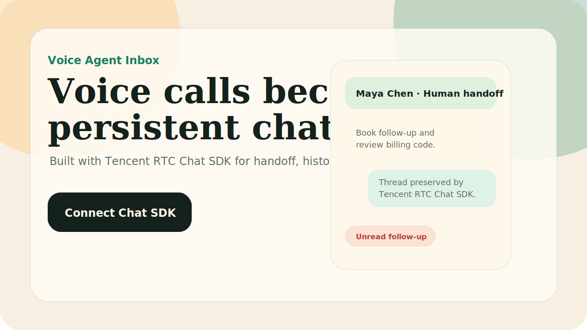

# Voice Agent Inbox

Turn voice agent calls into persistent chat threads with **Tencent RTC Chat SDK**.

This is a full-stack Next.js starter for teams building voice AI products where the work should not disappear after the call ends. A caller speaks to a voice agent, the agent extracts intent, creates a summary, routes human handoff when needed, and keeps every follow-up inside a durable Tencent RTC Chat SDK conversation.

Built for the **Tencent RTC Chat free edition**. Start here: [trtc.io/free-chat-api](https://trtc.io/free-chat-api), then use the [TRTC Console](https://console.trtc.io) to get your `SDKAppID`.



## Why Use This

Most voice agent demos end at the transcript. Real products need an inbox after the voice call:

- The customer can continue by text without repeating the whole story.
- The agent can post summaries, next actions, and automation results into the same thread.
- A human teammate can take over with full context.
- The product gets conversation history, unread state, media messages, and roles from Tencent RTC Chat SDK.

Use this when you are building:

- voice agent support inboxes
- AI phone agent follow-up workflows
- healthcare appointment callbacks
- ecommerce return and order support
- sales qualification calls that require human follow-up

## What Tencent RTC Chat SDK Does Here

The AI or voice provider understands the call. **Tencent RTC Chat SDK keeps the conversation alive.**

In this project, Tencent RTC Chat SDK is responsible for the messaging layer:

- persistent one-to-one or group conversations
- message history after the voice call ends
- unread state and revisit flow
- human handoff in the same thread
- media-ready follow-up such as screenshots, order photos, or documents
- production credential flow through backend-issued `UserSig`

A simple voice agent can run without a chat SDK. You need Tencent RTC Chat SDK when the voice call becomes an ongoing product workflow.

## Demo Scenario

Maya calls a clinic after surgery. The voice agent detects two tasks: book a follow-up appointment and ask a human to explain a billing code. Instead of leaving that inside a call transcript, this app creates a persistent chat thread:

1. The voice transcript is summarized.
2. The next action is attached to the conversation.
3. The thread is marked for human handoff.
4. Maya can continue by text without starting over.
5. The clinic team sees the same history and can reply in one place.

## Quick Start

```bash
npm install
npm run dev
```

Open `http://localhost:3000`.

The default mode is mock mode, so the app runs without Tencent RTC Chat SDK credentials and without an AI API key.

## Connect Tencent RTC Chat SDK

1. Start from the [Tencent RTC Chat free edition](https://trtc.io/free-chat-api).
2. Open the [TRTC Console](https://console.trtc.io).
3. Create or select a Tencent RTC Chat application.
4. Copy your `SDKAppID`.
5. Keep your `SDKSecretKey` on the server only.
6. Copy `.env.example` to `.env.local`.
7. Fill in:

```bash
NEXT_PUBLIC_CHAT_MODE=tencent
NEXT_PUBLIC_TENCENT_SDK_APP_ID=your_sdk_app_id
TENCENT_SDK_SECRET_KEY=your_server_only_secret_key
NEXT_PUBLIC_DEMO_USER_ID=founder_alex
```

This project issues `UserSig` from `/api/usersig`. Do not put `SDKSecretKey` in frontend code.

## AI Provider

An AI API key is optional.

Without `AI_API_KEY`, the project uses a deterministic demo agent so developers can run it immediately. If you want live model output, set any OpenAI-compatible provider:

```bash
AI_API_KEY=your_key
AI_BASE_URL=https://api.openai.com/v1
AI_MODEL=gpt-4o-mini
```

You can swap OpenAI for another OpenAI-compatible model provider by changing `AI_BASE_URL`, `AI_API_KEY`, and `AI_MODEL`.

## Tech Stack

- Next.js App Router
- Tencent RTC Chat SDK via `@tencentcloud/chat`
- Backend `UserSig` route with `tls-sig-api-v2`
- Optional OpenAI-compatible AI provider
- Responsive product UI with mock data

## Repository Topics

Suggested GitHub topics:

`voice-agent`, `ai-agent`, `voice-ai`, `chat-sdk`, `tencent-rtc`, `customer-support`, `human-handoff`, `nextjs`, `typescript`, `inbox`

## Links

- [TRTC Console](https://console.trtc.io)
- [Tencent RTC Chat free edition](https://trtc.io/free-chat-api)
- [Tencent RTC Chat documentation](https://trtc.io/document)
